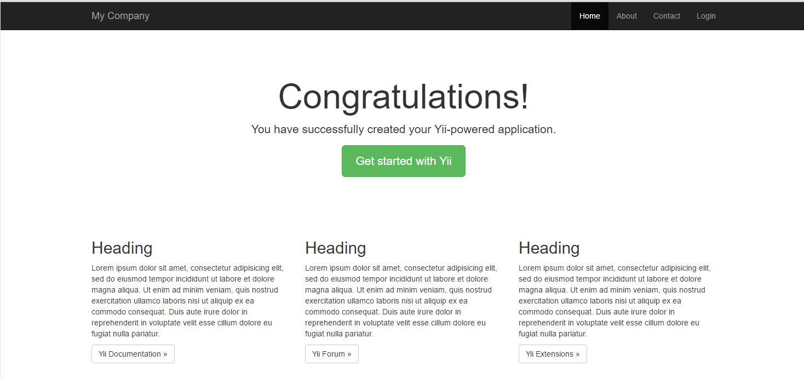

# Yii2 Link Redirection Sample Project

This project is intended for people who want to learn Yii2.

The aim is to outline what the resulting app should do, and show the steps that I took to create it.

It is not a walk through project. You should take a look at each step and try to do the work yourself with the links provided. If you run into trouble, each step has a related commit which shows the steps that I took, that you can refer to when building your app.

Feel free to improve upon it.

##The Plan

We all link to websites for further information, but websites change and links get broken.

That's no problem for a website as they can just update the link, but, for an offline publication, it's not possible to correct broken links, so over time, the information quality degrades.

For this reason, we are about to create a link redirection app that will redirect local links to their final destination which can be easily updated.

The aims for this projects functionality are as follows:

* When someone arrives at the site, the requested url is checked against our list of redirected urls. It redirects or shows a 404 error.
* When someone is redirected, we send an event to Google analytics to record how many people arrive at each link.
* We create a command line cron to periodically check all of the links to make sure none are broken.
* If the cron detects a broken link, we use a mail template to email the admin and inform them that a link is broken, with an admin link to update the destination.

##Step 1 : Installing the Basic App Skeleton

Install the Yii2 basic app, via composer, to a web accessible directory by following the instructions on the Github page: [https://github.com/yiisoft/yii2-app-basic](https://github.com/yiisoft/yii2-app-basic)

Make sure that you install the composer asset plugin globally or bower assets such as Bootstrap and jQuery won't get installed. The install would seem broken without it.

In this repository, the application is in the linkapp folder.

----------
Once installed, browse to the web folder and you should see a basic app.

Yii2 is installed.

